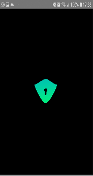
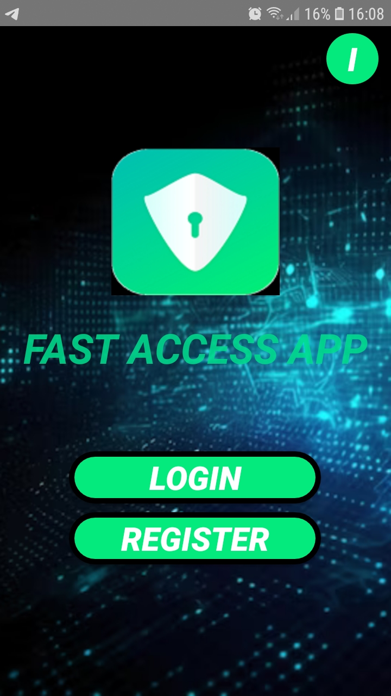
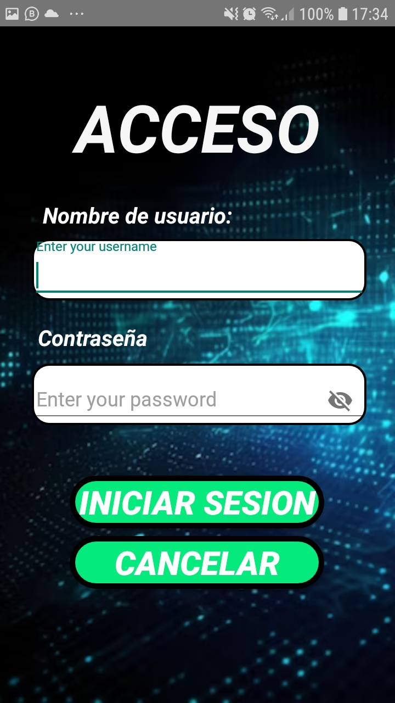
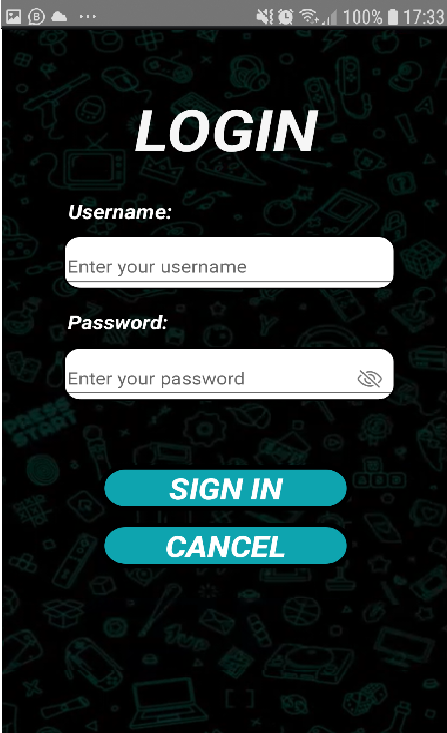
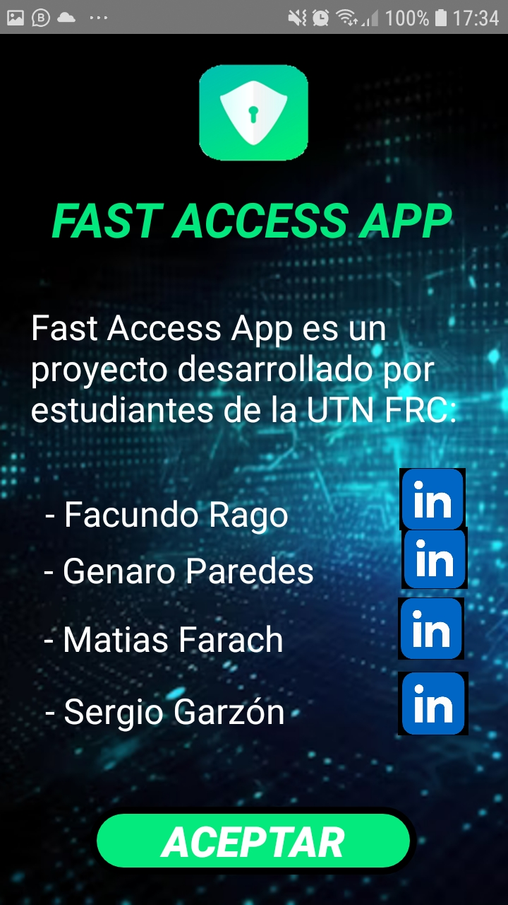
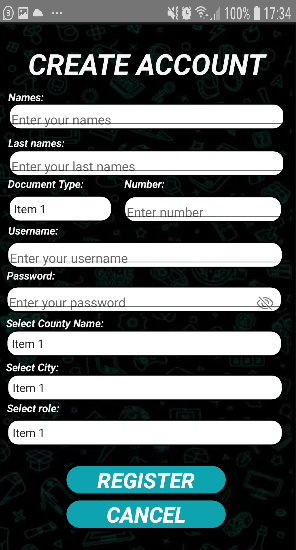
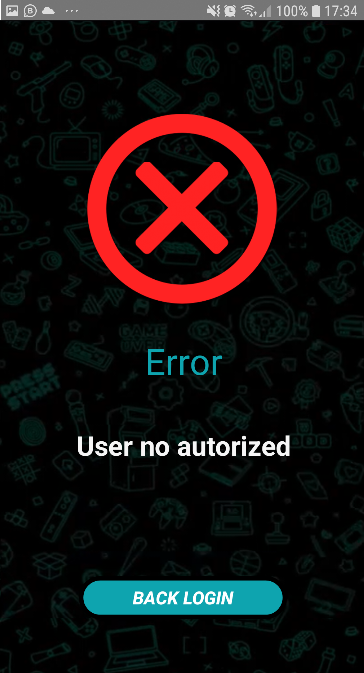
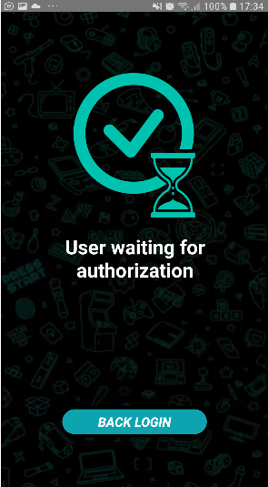
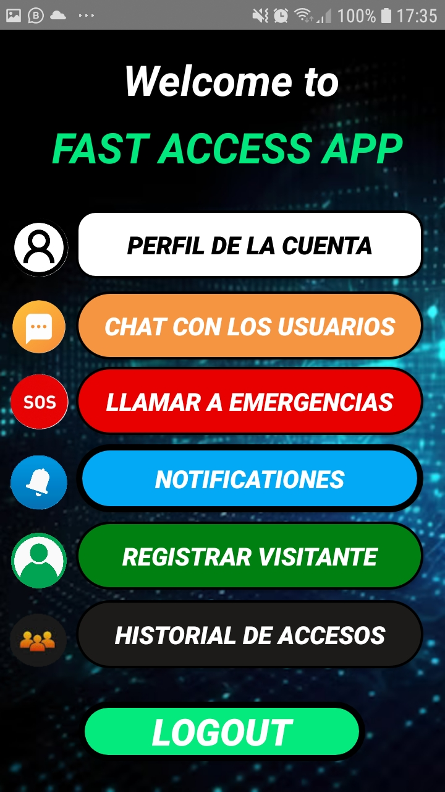
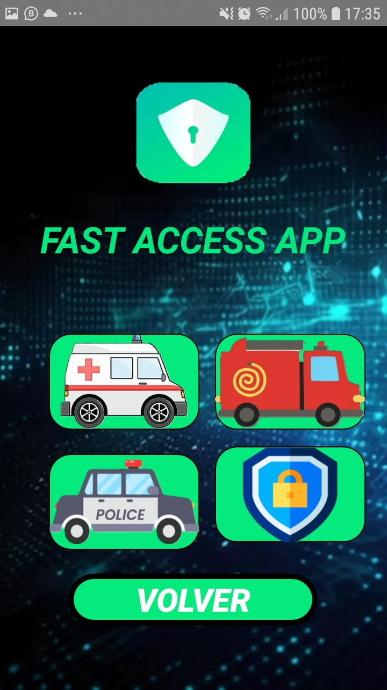

 # "FAST ACCESS APP" Applications

This application is for the final project of Integrative Seminar subject of the Information System Engineering degree at the National Tecnological University of Córdoba (*UTN FRC* - Universidad Tecnologica Nacional - Facultad Regional Córdoba)

##### **Members**
> * Farach, Matías Leonel (Functional Analyst)
> * Garzón, Sergio (Developer)
> * Paredes, Genaro (Functional Analyst)
> * Rago, Facundo Matías (UX/UI designer)

#### Application screen

##### Plash Screen

##### Main Screen

##### Login

##### Login with validation

##### Credits

##### Register a new account

##### Successful account registration

##### Login failed (Unauthorized account)

##### Login pending (Account on hold)

##### Application menu

##### Emergency calls

