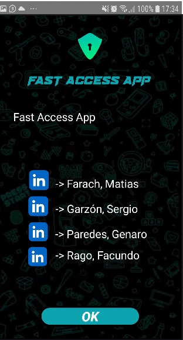

 # Aplicación "FAST ACCESS APP"

Esta aplicación es para el proyecto final de Seminario Integrador de la carrera de Ingenieria en Sistemas de Información de la Universidad Tecnologica Nacional - Facultad Regional Córdoba

##### **Integrantes**
> * Farach, Matías Leonel
> * Garzón, Sergio
> * Paredes, Genaro
> * Rago, Facundo Matías

#### Pantallas de la aplicación

##### Plash Screen

##### Pantalla inicial

##### Login

##### Login con validación

##### Creditos

##### Registrar nueva cuenta

##### Cuenta registrada exitosamente

##### Inicio de sesión fallido (Cuenta no autorizada)

##### Inicio de sesión en espera (Cuenta en espera)

##### Menu de la aplicación

##### Llamadas de emergencia

